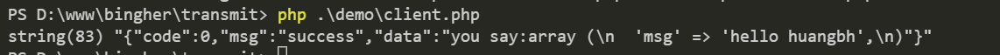

# bingher/transmit
> thrift php 简单封装用于生成服务端及客户端

## 安装
```
composer require bingher/transmit
```

## 使用说明
- 服务端:定义了通用调用接口`invoke`,传参:方法名及数组json字符串参数,继承`\bingher\transmit\Server`后只要写相关业务逻辑即可
```
<?php
require __DIR__ . '/../vendor/autoload.php';

class TransmitHandler extends \bingher\transmit\Server
{
    public function sayMsg($params)
    {
        return 'you say:' . var_export($params, true);
    }
}

$host = '0.0.0.0';
$port = 9000;

TransmitHandler::run($port, $host);
```


- 客户端:实例化客户端,调用服务端的方法及数组传参即可
```
<?php
require __DIR__ . '/../vendor/autoload.php';

$client = new \bingher\transmit\Client('127.0.0.1', 9000);

$res = $client->sayMsg(['msg' => 'hello huangbh']);
var_dump($res);
```


## 参考资料
- [python 使用 thrift 教程](https://www.cnblogs.com/shenh/p/10529073.html)
- [Thrift PHP 示例](https://www.jianshu.com/p/2532056dd494)
- [windows基于Thrift的php客户端访问java的服务端](http://www.voidcn.com/article/p-txjzuqkx-bs.html)
- [Thrift（PHP）入门无错篇章](https://www.cnblogs.com/ddcoder/p/7647186.html)
- [Thrift在php框架laravel中的应用](https://libisky.com/post/a34e8b68d4ff)
- [thrift框架搭建的php服务端/客户端代码](https://blog.csdn.net/shi_yi_fei/article/details/62893605)

```
./tool/thrift-0.13.0.exe -gen py ./tool/transmit.thrift
./tool/thrift-0.13.0.exe -gen php ./tool/transmit.thrift
./tool/thrift-0.13.0.exe -gen java ./tool/transmit.thrift
```
